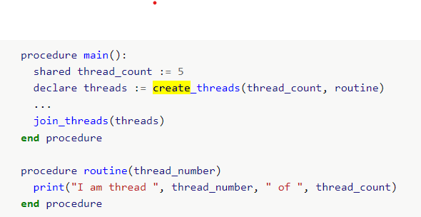

# Ejercicio 22 [create_threads_pri]
	En pseudocódigo se introdujeron dos procedimientos para crear y esperar por equipos de hilos:

	El procedimiento create_threads() crea un equipo de hilos, todos ejecutando el procedimiento routine() concurrentemente, y retorna un arreglo de valores que representan hilos de ejecución. De forma análoga, el procedimiento join_threads() recibe el arreglo de hilos y espera a que todos ellos finalicen su ejecución.

	Contar con estos dos procedimientos reutilizables es sumamente útil para la implementación de equipos de hilos en el paralelismo de datos. En la implementación de Ejemplo 10 se proveen estas dos subrutinas, sin embargo, no proveen a los hilos secundarios su número de hilo en el equipo.

	Modifique la subrutina create_threads() para que cree en la memoria dinámica e inicialice un arreglo de registros de datos privados. Cada registro tiene cuatro valores: el número de hilo (obtenido del índice de un ciclo), la cantidad de hilos en el equipo, el puntero a los datos compartidos (recibido por parámetro), y el identificador del hilo (pthread_t) inicializado con pthread_create(). Envíe la dirección del registro privado a cada hilo al crearlo con pthread_create(). Finalmente create_theads() retorna la dirección de este arreglo de registros privados.

	Modifique a join_threads() para que reciba la cantidad de hilos y la dirección al arreglo de registros privados. Luego espera por cada hilo con pthread_join(). Finalmente libera el arreglo.

	Con estos cambios, los hilos podrán saber su número de hilo (thread_number) y la cantidad de hilos que hay en el equipo (thread_count) accediendo a los campos del registro privado. Con esta información implemente lo solicitado en el enunciado de Ejemplo 10: cada productor y cada consumidor debe reportar su número de hilo en la salida estándar.