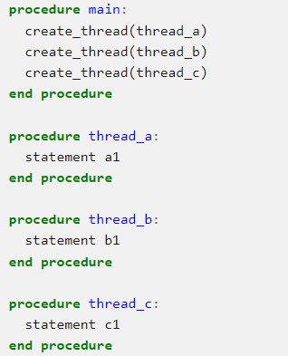

# Ejercicio 29 [signaling_3]
    Modifique los códigos de los hilos para que la instrucción a1 se ejecute siempre antes que la instrucción b1 y ésta siempre se ejecute antes que la instrucción c1. Este orden de ejecución puede abreviarse como a1 < b1 < c1.

    Actualice la red de Petri para que el aviso se dé entre los tres hilos.