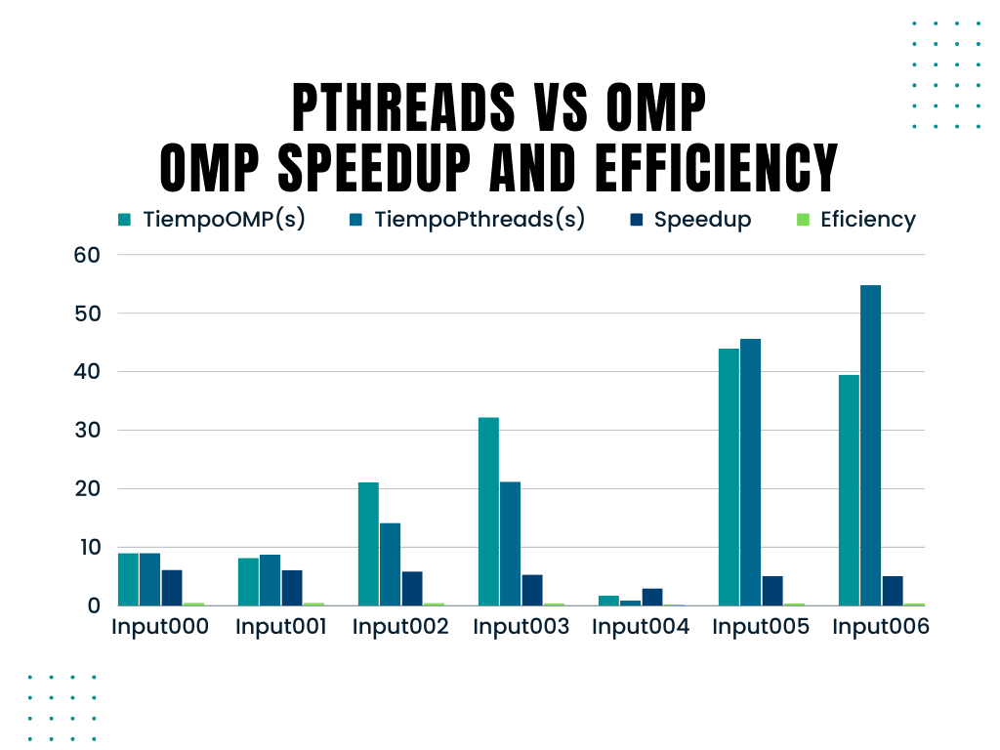

# Tarea 4 C12243

## Pthreads vs OMP
    Se hace una comparacion en los tiempos obtenidos en la tarea 3 de mapeo estatico, con la implemetacion de OMP. La unica diferencia es que el mapeo utilizado con OMP es dinamico ya que mostro mejores resultados, se puede ver como en algunos casos gana Pthreads y en otros OMP, a veces es por milesimas de segundo, factor que puede influir serial que Pthreads crea y prueba contrasenas, y OMP crea todo serial en un vector y luego prueba de manera concurrente, ademas de que el tipo de mapeo es distinto, sin embargo la diferencia mas notoria es en el caso 7 que pthreads demuestra ser mas veloz.

### Pthreads
    Input000.txt = 9.033s
    Input001.txt = 8.746s
    Input002.txt = 14.167s
    Input003.txt = 21.198s
    Input004.txt = 0.882s
    Input005.txt = 45.605s
    Input006.txt = 54.772s
    Input007.txt = 117.304s
    
### OMP                   
    Input000.txt = 9.022s
    Input001.txt = 8.167s
    Input002.txt = 21.091s
    Input003.txt = 32.229s
    Input004.txt = 1.716s
    Input005.txt = 43.936s
    Input006.txt = 39.485s
    Input007.txt = 462.02s

    En la siguiente grafica tambien se observan el speedup y efficiency de OMP con respecto a ese codigo corriendo con 1 hilo(serial)

# Grado de concurrencia
    El propósito de este análisis es evaluar y comparar el grado de concurrencia con respecto a los tiempos de ejecución en el contexto de la implementación OpenMP utilizando diferentes cantidades de hilos. Estas pruebas se llevaron a cabo con el fin de determinar cómo la eficiencia y el rendimiento del sistema varían en función de la cantidad de hilos utilizados.

    Es relevante destacar que, en este caso, se han realizado múltiples corridas del programa con diferentes configuraciones de hilos para observar cómo impacta la cantidad de hilos en los tiempos de ejecución.

    Los resultados indican que, en general, el mejor rendimiento se obtiene cuando se utilizan la cantidad máxima de hilos disponible en la máquina, que en este contexto específico es de 12 hilos. Esto sugiere que el sistema es capaz de aprovechar al máximo los recursos de la máquina cuando se utilizan todos los núcleos de procesamiento disponibles.

