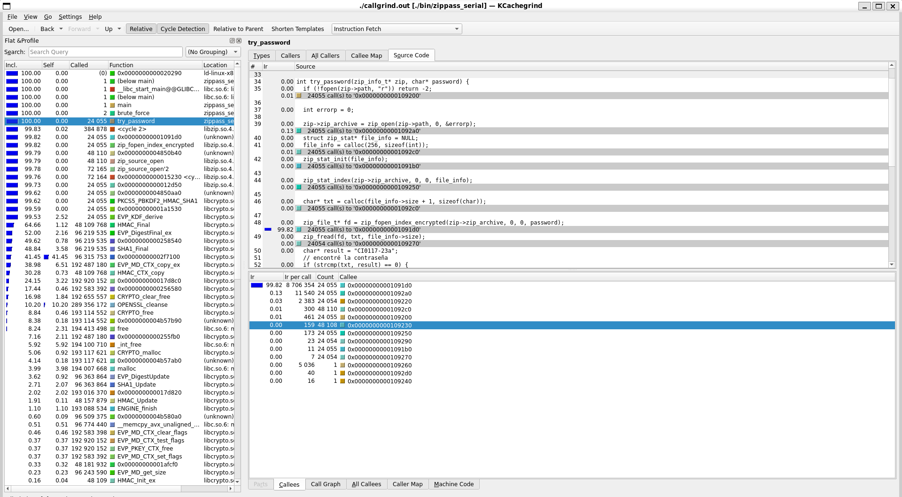
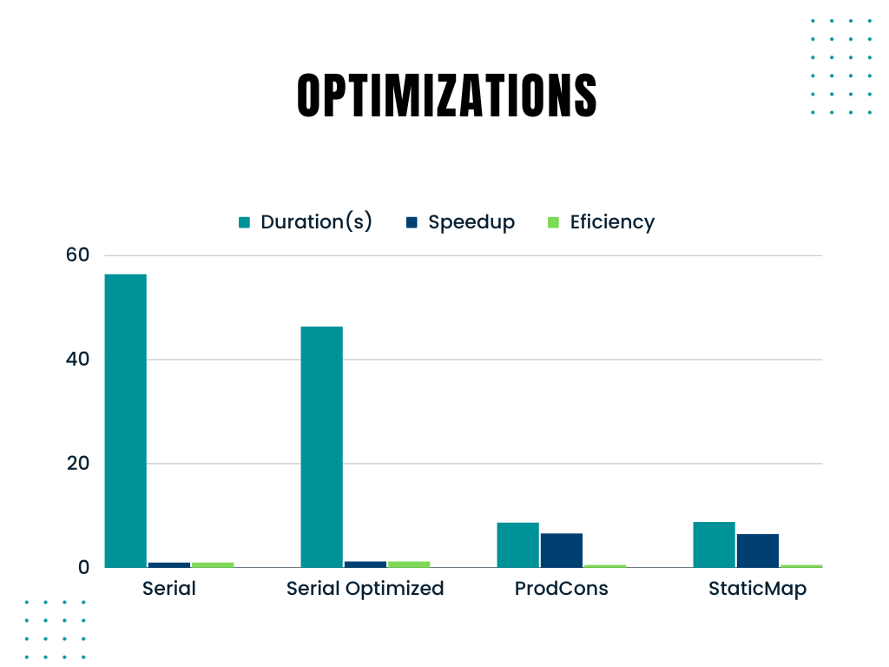

# Tarea 3 C12243

## Optimizacion de la tarea serial

    Para mejorar el rendimiento de mi tarea serial, realicé dos cambios clave. Al revisar la implementación inicial, noté que ya estaba bastante optimizada en su entrega inicial.

    El primer cambio consistió en la extracción de la operación zip_open, lo que permitió ahorrar tiempo al evitar abrir y cerrar repetidamente el archivo zip en cada intento de contraseña. Ahora, el archivo se cierra solo cuando se encuentra la contraseña correcta o después de probar todas las contraseñas sin éxito.

    El segundo cambio implicó eliminar una línea que añadía '\0' al final de cada contraseña. Al quitar esta línea, descubrí que no era necesaria y, de hecho, el programa continuó funcionando sin problemas, al tiempo que mejoró el rendimiento.

    Estas modificaciones han tenido un impacto notable en la velocidad de ejecución, lo cual se visualizara posteriormente.

## Optimizacion productor consumidor

    En esta tarea, no se requirió una optimización extensa. La principal mejora consistió en reducir la región cubierta por los mutex, lo que resultó en un mayor rendimiento en comparación con la implementación inicial del patrón Productor-Consumidor. Sin embargo, no se llevaron a cabo mediciones comparativas con la versión anterior, ya que el enunciado no lo especificaba.

## Implemetacion de Mapeo estatico

    En esta sección, se implementó la concurrencia utilizando el mapeo estático, en contraste con la tarea anterior en la que se utilizó el patrón Productor-Consumidor.

# Comparación de optimizaciones

    Una vez que contamos con todas las implementaciones necesarias para esta tarea, procedimos a realizar las ejecuciones de los casos de prueba en cada una de ellas. Este proceso nos brindó una clara visualización de la mejora en los tiempos de ejecución, comparando las versiones seriales antes y después de su optimización.

    Es importante destacar que ambas implementaciones seriales quedaron significativamente rezagadas en términos de tiempo en comparación con sus contrapartes que hacen uso de la concurrencia. No obstante, al tener ambas implementaciones concurrentes disponibles, se observa que en algunos casos los tiempos son bastante similares. Sin embargo, en la mayoría de los casos, el mapeo estático lidera en términos de tiempo, aunque sea por un margen reducido.

    A continuación, presentaremos los resultados de las ejecuciones realizadas para todos los casos de prueba en las implementaciones: Serial, Serial optimizada, Patrón Productor-Consumidor y, por último, Mapeo Estático.

## Serial vs Serial Optimized

### Serial

* input000: Execution time: 63.043190852s
* input001: Execution time: 56.353081879s
* input002: Execution time: 139.806011226s
* input003: Execution time: 186.943533335s
* input004: Execution time: 4.927666516s
* input005: Execution time: 247.347618512s
* input006: Execution time: 230.530752070s
* input007: Segmentation fault

### Serial Optimized

* input000: Execution time: 51.542242527s
* input001: Execution time: 46.290963600s
* input002: Execution time: 114.868776112s
* input003: Execution time: 162.848865204s
* input004: Execution time: 3.992335542s
* input005: Execution time: 211.241295713s
* input006: Execution time: 191.058031724s
* input007: No da segmentation, pero peta

## ProducerConsumer vs Static Mapping

### ProducerConsumer

* input000: Execution time: 9.346358589s
* input001: Execution time: 8.604510329s
* input002: Execution time: 20.795302116s
* input003: Execution time: 30.065450156s
* input004: Execution time: 0.963837482s
* input005: Execution time: 38.079348052s
* input006: Execution time: 36.437317824s
* input007: Execution time: 430.283069557s

### Static Mapping

* input000: Execution time: 9.033079070s
* input001: Execution time: 8.746886605s
* input002: Execution time: 14.167856539s
* input003: Execution time: 21.198156675s
* input004: Execution time: 0.882959878s
* input005: Execution time: 45.605490980s
* input006: Execution time: 54.772101696s
* input007: Execution time: 117.304300145s

# Optimizaciones

    En esta sección, se llevó a cabo la creación de un gráfico de comparación que involucra los valores de tiempo, speedup y eficiencia en el caso de prueba 001. Este análisis nos proporciona una visión notable de cómo la velocidad de ejecución se ha incrementado de manera significativa al pasar de una implementación puramente serial a la incorporación de la concurrencia en el proceso. Además, hemos calculado y registrado los valores de speedup y eficiencia para cada una de las implementaciones de esta tarea.

    Este ejercicio de comparación se ha revelado como una herramienta esencial para comprender la diferencia que puede lograrse al optimizar la ejecución de tareas a través de la concurrencia. Al observar los datos registrados en el gráfico, se evidencia de manera impresionante cómo la paralelización de procesos ha impactado de manera positiva en el rendimiento de la tarea.

    En particular, se ha observado un incremento notable en la velocidad de ejecución de la tarea, lo cual se refleja en una drástica disminución del tiempo requerido para completar el caso de prueba 001. Esto subraya la importancia de adoptar enfoques concurrentes cuando se busca mejorar la eficiencia de un sistema.

    Adicionalmente, los valores calculados de speedup y eficiencia ofrecen una comprensión cuantitativa de las mejoras logradas en cada implementación. Estos valores son fundamentales para evaluar y cuantificar el grado de optimización que se ha alcanzado al implementar la concurrencia en la tarea.

# Grado de concurrencia

    El propósito de este análisis es evaluar y comparar el grado de concurrencia con respecto a los tiempos de ejecución en el contexto de la implementación del Patrón Productor-Consumidor utilizando diferentes cantidades de hilos. Estas pruebas se llevaron a cabo con el fin de determinar cómo la eficiencia y el rendimiento del sistema varían en función de la cantidad de hilos utilizados.

    Es relevante destacar que, en este caso, se han realizado múltiples corridas del programa con diferentes configuraciones de hilos para observar cómo impacta la cantidad de hilos en los tiempos de ejecución.

    Los resultados indican que, en general, el mejor rendimiento se obtiene cuando se utilizan la cantidad máxima de hilos disponible en la máquina, que en este contexto específico es de 12 hilos. Esto sugiere que el sistema es capaz de aprovechar al máximo los recursos de la máquina cuando se utilizan todos los núcleos de procesamiento disponibles.

