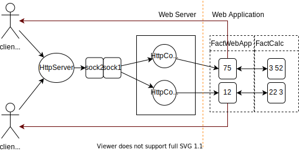
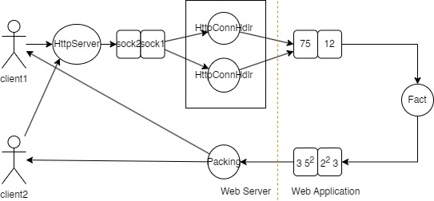
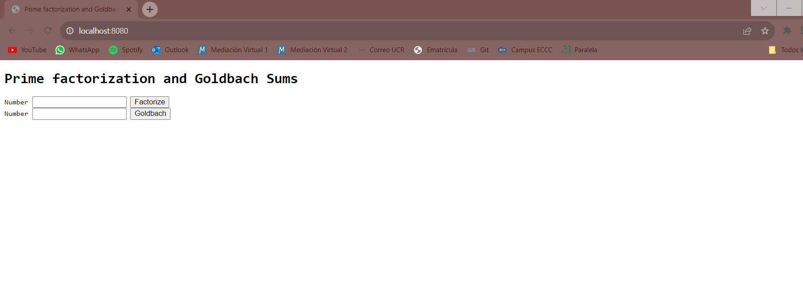
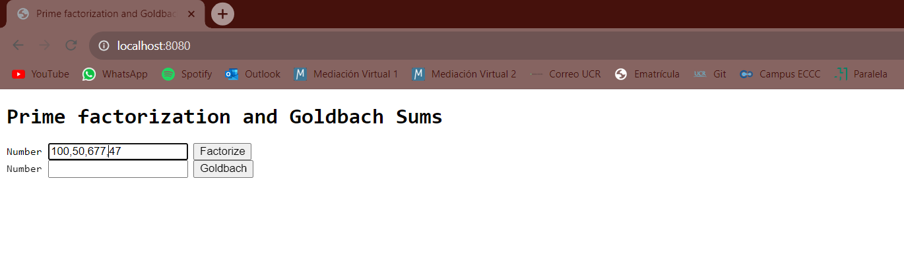
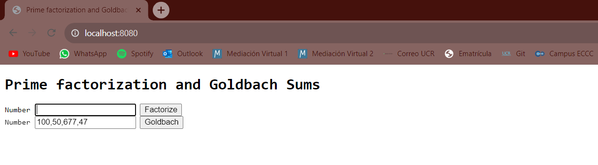
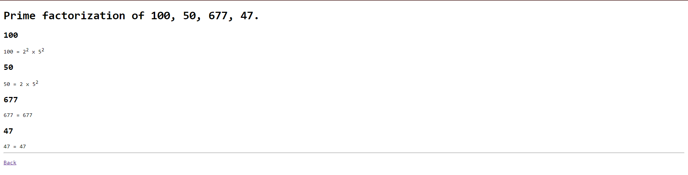
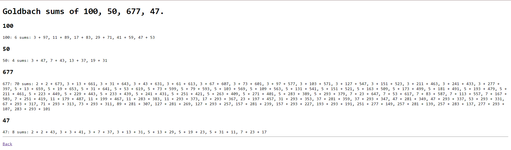

# Proyecto 1: Servidor concurrente y distribuido

## Problema

Se heredo un codigo en donde se implementaba un servidor web que se comporta de manera serial. El reto del equipo en este proyecto fue convertir este servidor web serial en uno concurrente para que naturalmente pueda atender varias conexiones de clientes al mismo tiempo, como ocurre en la vida real.


<sub> Figura 1: Diseño parcial del servidor concurrente

### Primer avance

En lo que fue el primer avance para resolver este problema, fue alterado unicamente el codigo del servidor y no el de las aplicaciones web. De esta manera, estas se ven beneficiadas por la concurrentcia del servidor aunque sigan siendo seriales

Al iniciar, el servidor web recibira dos argumentos de linea de comandos. El primer argumento es el puerto en el que el servidor web esperara por conexiones de clientes, mientras que el segundo argumento indica el numero maximo de conexiones de clientes que el servidor web debe permitir de manera concurrente. Si este numero no se indica, se puede suponer tantas conexiones como CPUs hay disponibles en la maquina. Una vez que el servidor inicia, se debe crear este numero de hilos que se encargaran de atender conexiones.

Como ya fue mencionado, las aplicaciones web (Factorizacion y Sumas de Goldbach) no se hicieron de manera concurrente. Sin embargo, estas fueron implementadas segun el paradigma de programacion orientada a objetos, en coherencia con el resto de la base del codigo provisto. De esta manera el codigo del servidor web, las aplicaciones y el calculo de las factorizaciones y sumas de Goldbach (modelos), estan en objetos separados.

Al finalizar el servidor web (con Ctrl+C o el comando kill), en teoria, este hace la limpieza debida, se detiene de aceptar nuevas conexiones de clientes, avisa a los hilos secundarios para que terminen su ejecucion, espera que terminen el trabajo pendiente, y finalmente libera todos los recursos sin provocar fugas de memoria ni otros problemas.

[Aquí](design/README.md) puede observar los diseños de las clases utilizadas, además del flujo de datos y concurrencia del proyecto

### Segundo Avance

En este avance se creó una solución que realiza un mejor uso de los recursos de la máquina, al hacer concurrente las aplicaciones web que calcula las factorizaciones primas y las sumas de goldbach. Las aplicaciones crean tantas calculadoras como CPUs hay disponibles en el sistema. Si el equipo de desarrollo lo quiere, puede ofrecer un tercer argumento de línea de comandos que controle esta cantidad de calculadoras, pero no es obligatorio.

En esta segunda entrega, se modifican las aplicaciones web para que no hagan un consumo agresivo o desequilibrado de los recursos de la máquina. Esta modificación consiste en hacer a la aplicación web concurrente, para que pueda controlar la cantidad de hilos que realmente consumen CPU en el cálculo de los factores primos, para que estos no superen la cantidad de núcleos de procesador disponibles en el sistema, y para equilibrar mejor la carga de trabajo entre los hilos de ejecución.

El diagrama de flujo de datos hecho en el avance anterior se actualizó para reflejar una cadena de producción optimizada que aplica el patrón productor-consumidor. El diseño de la Figura 2 es incompleto, pero fue la base para ejemplificar algunos de los cambios que el equipo de desarrollo consideró para este trabajo.


<sub> Figura 2: Diseño parcial de las apps concurrentes

## Manual de Usuario

A continuacion se presenta una explicacion mas detallada del funcionamiento del proyecto, asi como todos los lineamientos y parametros necesarios para su correcta compilacion.

### Compilacion

1. Asegurese de tener instalado un compilador de C++ compatible instalado (probado con GCC)
2. Abra un terminal y navegue al directorio donde se encuentra el archivo de codigo fuente. Deberia de seguir una ruta similar a la siguiente:

```text
../../los-paraplejicos-23b/Proyecto-1
```

3. Para compilar el programa ejecute los siguientes comandos desde la terminal:

```text
make clean; make -j8
```

El comando `make clean` realiza una limpieza completa de todas las carpetas y archivos creadas por algun tipo de compilacion previa

La instruccion `make -j8` es la que realiza la compilacion del programa. El valor -j8 es una forma de expresar que la compilacion se realizara con el uso de 8 nucleos de la computadora. Este valor puede ser dado o puede ser modificado dependiendo de la cantidad de nucleos que la computadora posea.

Al finalizar la compilacion, la terminal no deberia de desplegar ningun tipo de mensaje tipo Warning ni errores.

### Ejecucion

1. Si el codigo compila de manera correcta, entonces para poner en ejecucion el programa debera de colocar el siguiente comando en su terminal:

```text
bin/Proyecto-1 8080 5
```

En este ejemplo, el primer argumento hace referencia al puerto en el que el servidor web esperara por conexiones de clientes (8080), mientras que el segundo argumento (5) indica el numero maximo de conexiones de clientes que el servidor web debe permitir de manera concurrente.

Si este numero no se indica, el programa toma como numero de conexiones tantas como CPUs hay disponibles en la maquina.

2. Una vez el comando anterior sea ejecutado, en su terminal debera de aparecer el siguiente mensaje, que indica que el programa esta activo y se puede comenzar a utilizar el servidor.

```text
Info    webserver       Listening on 0.0.0.0 port 8080
```

### Funcionalidad

Para esta seccion, utilice su navegador de preferencia.

1. Para poder acceder al servidor, abra una pestana de su navegador y coloque en la barra de busqueda una de las siguientes lineas con el numero de puerto que haya escogido:

```text
http://localhost:8080/fact

http://localhost:8080/gold
```
Esto lo lleva al homepage de cada uno de los modelos de operaciones que realizamos

2. Al presionar la tecla ENTER, en su navegador debera de mostrarse lo siguiente:



3. Ingrese en el rectangulo correspondiente los numeros que desee factorizar o de los cuales quiera obtener las sumas de goldbach (es importante que al digitar los numeros, estos esten separados unicamente por comas).


<sub> Caso para probar factorizacion


<sub> Caso para probar sumas de Goldbach

4. Al hacer clic en el boton correspondiente, este desplegara la respuesta provista por los metodos correspondientes a la operacion seleccionada.


<sub> Caso para probar factorizacion


<sub> Caso para probar sumas de Goldbach

5. Para regresar al homepage, solo debera de presionar el boton `Back` provisto al final de cada pagina, como se puede observar en las imagenes anteriores

## Creditos

Curso: CI-0117b Programacion Paralela y Concurrente

Integrantes:
- Daniel Conejo Chevez, C12243
- Dariel Alvarez Gonzalez, C20413
- Marco Antonio Angulo Rodriguez, C10458
- Werner Naranjo Navarro, C15464

Referencias: 
    - Criba de Erastoteles [Sieve of Eratosthenes](https://www.geeksforgeeks.org/sieve-of-eratosthenes/)