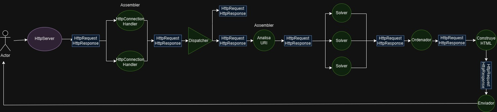

# Guia para el diseno

## Diseno de clases en UML

    En la siguiente imagen se muestra una distribucion del manejo de clases utilizado en este proyecto, cabe destacar que como ya habia codigo previo, en algunas clases se modificaron solo algunos metodos, por lo cual son loso unicos agregados en el diseno, ademas de la relacion existente entre esos metodos:

## Diseno de flujo de datos

    Ademas de la mejora del diagrama de flujo de datos, que se sabe que inicialmente estaba disenado de manera serial, por lo cual realizamos una adaptacion a la concurrencia implementada en el servidor:

