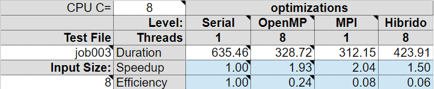
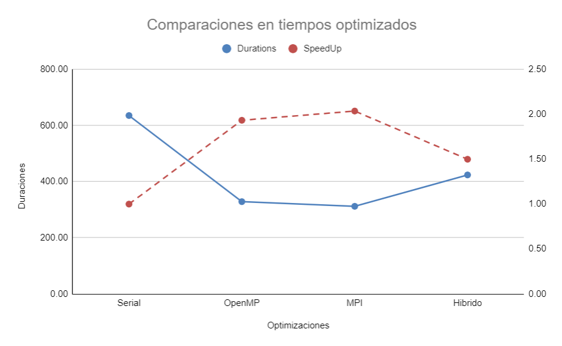

# Analisis

Se puede evidenciar en la tabla comparativa que la versión más rápida es la que utiliza la tecnología MPI solamente, pues mantiene el mayor speedup de entre las versiones comparadas. Pero no hay que revisar únicamente el speedup, pues al mirar la eficiencia, ambas implementaciones de MPI tienen peor eficiencia que OpenMP por si solo. Creemos que se debe a la forma de repartición de los plates para cada proceso en MPI, puesto que a solo 1 proceso le puede tocar los plates más pesados de calcular. Por otro lado, para la tecnología OpenMP, estos siempre se reparten el trabajo de las celdas del plate, para cada plate, por lo que trabajan aproximadamente similar o menos 8 hilos en OpenMP que 24 procesos en MPI, pero al ser 24, la eficiencia es muchísimo menor.

